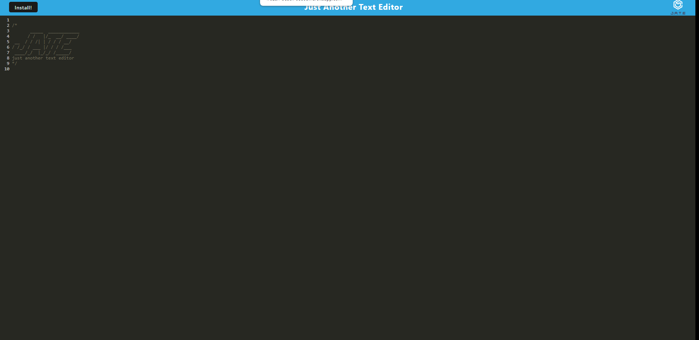

### License: , (https://opensource.org/licenses/MIT)

# Title: Text Editor

## screenshot
.png)

## link to deployed app
https://frozen-beach-93593.herokuapp.com/

## Description:
This app is a simple text editor that runs in-Browser, it can be installed and work offline as well.
## Table of Contents:
* [title](#title)
* [Description](#description)
* [Table of Contents](#table-of-contents)
* [Installation](#installation)
* [Usage](#usage)
* [License](#license)
* [Contributing](#contributing)
* [Testing](#testing)
* [Questions](#questions)
      
## Installation: 
To install just click on the link in the repo, when the page loads click the "install" button.

## Usage: 
just have fun with it!!
## Licensing: This application is covered under MIT License.

## Contributing: 
feel free to contribute>
## Testing Instructions: 
testing was done in code editor/terminal.
## Questions: 
Ask away
Contact Me:

Github: https://github.com/banjosquash

Email: braymcmahan@yahoo.com
